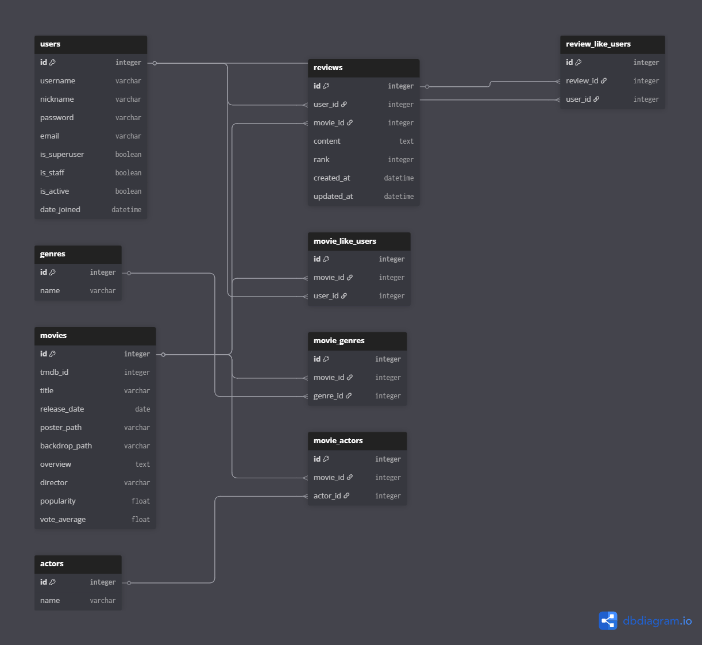
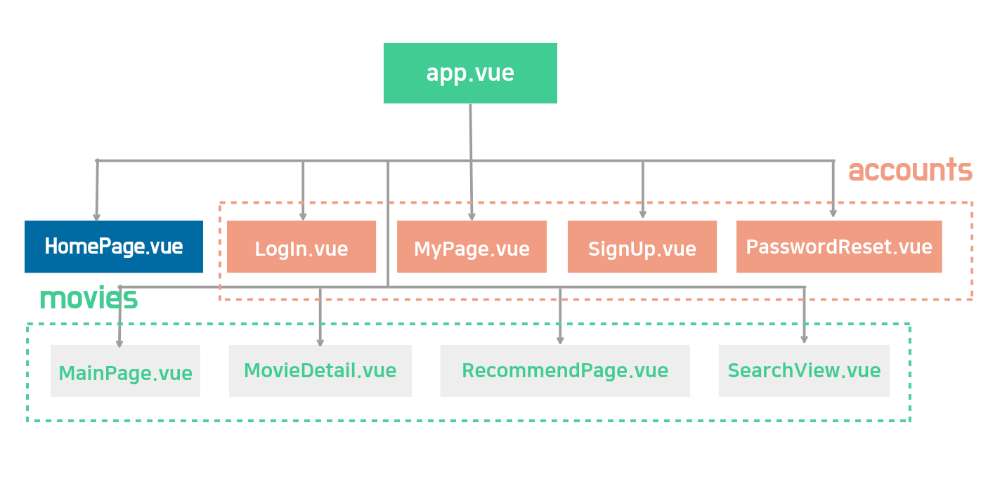

# SyncMovie
추천 알고리즘을 통한 영화 추천 커뮤니티 서비스를 구축하려고 한다.<br>
TMDB에서 제공되는 영화 정보를 활용 목적에 맞게 전처리하여 사용하고, 이를 기반으로 줄거리, 인물 기반 영화 추천, 장르별 영화 탐색 등 다채로운 추천 기능을 설계 및 구현한다.<br>
또한 영화에 대한 사용자 리뷰 및 감상평 공유 커뮤니티 기능을 제공하여, 사용자들이 활발하게 소통하고 정보를 교환할 수 있는 기능을 제공한다.<br>
사용자는 자신이 본 영화를 평가하고, 다른 사용자의 리뷰를 참고하여 다음 영화를 선택하는데 도움을 받을 수 있다.<br>
나아가, 관심 영화 목록을 맞춤형으로 구성하는 등 다양한 편의 기능을 제공한다.<br>

## 팀원 및 업무 분담
- 팀장: 이영종 - 권한, 인증 및 커뮤니티 관련 기능 개발, 메인페이지, 영화 상세페이지 개발
- 팀원: 문희원 - 추천 페이지 및 추천 관련 기능 개발

## 기술 스택 (Tech Stack)
   - Backend: Django REST Framework (DRF)
       - 인증: dj-rest-auth + django-allauth
       - DB: SQLite
   - Frontend: Vue 3 + Vite + Pinia
       - 스타일링: Bootstrap 5


## Git 규칙
### branch 운영 방식
1. master branch에 직접 수정 x
2. yj, hw 브랜치로 분리해서 작업 후 이상 없을 시 master branch로 merge
3. 최종 merge전 팀원과 상의하고 conflict 발생 시 협의 후 코드 선택
### commit 기록 내역 원칙
1. **기능 요구사항 번호별**로 commit 진행
2. 개발 중 잘못된 사항이 발견되어 수정한 경우 동일한 commit내용에 _수정을 붙여서 commit
3. commit 내용 양식: 요구사항번호[_기능명][_수정(수정한 경우)]


## DataSet
- TMDB API를 이용해서 인기도 기준의 최신 영화를 6,000개 취합 후 전처리 하여 사용
- API 정보
    - 요청 방법: GET
    - 요청 URL: https://api.themoviedb.org/3/movie/popular
    - 응답 데이터 샘플
        {
        "page": 1,
        "results": [
            {
            "adult": false,
            "backdrop_path": "/iN41Ccw4DctL8npfmYg1j5Tr1eb.jpg",
            "genre_ids": [
                878,
                12,
                14
            ],
            "id": 83533,
            "original_language": "en",
            "original_title": "Avatar: Fire and Ash",
            "overview": "In the wake of the devastating war against the RDA and the loss of their eldest son, Jake Sully and Neytiri face a new threat on Pandora: the Ash People, a violent and power-hungry Na'vi tribe led by the ruthless Varang. Jake's family must fight for their survival and the future of Pandora in a conflict that pushes them to their emotional and physical limits.",
            "popularity": 499.2281,
            "poster_path": "/gDVgC9jd917NdAcqBdRRDUYi4Tq.jpg",
            "release_date": "2025-12-17",
            "title": "Avatar: Fire and Ash",
            "video": false,
            "vote_average": 7.258,
            "vote_count": 436
            },
            ...
        ],
        "total_pages": 54281,
        "total_results": 1085609
        }

## 목표 서비스 및 실제 구현 정도
- 기능적 요구사항

| 번호 | 요구사항명 | 요구사항 상세 | 우선순위 | 구현 여부 |
| --- | --- | --- | --- | --- |
| F-01 | 회원가입/탈퇴 기능 | 서비스 사용을 위해 사용자가 자신의 정보를 등록/삭제 하는 기능, 회원가입 시에는 최대한 간편하게 할 수 있도록 구현 | 높음 | o |
| F-02 | 로그인/로그아웃 | 등록된 데이터를 바탕으로 사용자가 자신을 인증/비인증 하는 기능 | 높음 | o |
| F-03 | 영화 목록 조회 | 유행중인 영화와 장르별 영화를 10개씩 출력하도록 구현 | 높음 | o |
| F-04 | 영화 상세보기 | 선택한 영화의 상세정보와 유저들의 후기와 별점이 출력되도록 구현 | 높음 | o |
| F-05 | 영화 후기(평가) 남기기 | 영화에 대한 평점과 후기(댓글)를 남길 수 있도록 구현 | 높음 | o |
| F-06 | 영화 후기에 좋아요 표시 | 영화 후기(댓글)에 좋아요 표시할 수 있도록 구현 | 높음 | x |
| F-07 | 영화에 좋아요 표시 | 영화 자체에 좋아요 표시할 수 있도록 구현 | 높음 | o |
| F-08 | 영화 추천 기능(줄거리 기반) | 영화 상세정보의 줄거리를 기반으로 유저가 선호하는 영화와 비슷한 줄거리의 영화를 추천할 수 있도록 구현 (협업 필터링 기반) | 높음 | o |
| F-09 | 영화 추천 기능(인물 기반) | 영화 상세정보의 등장 인물 기반으로 유저가 선호하는 영화와 비슷한 인물들이 등장하는 영화를 추천할 수 있도록 구현 (협업 필터링 기반) | 높음 | o |
| F-10 | 영화 추천 기능(USER 기반) | 유저가 좋아요를 표시한 영화들을 기반으로 비슷한 줄거리와 인물에 각각 적절한 가중치를 부여하여 알맞은 영화를 추천할 수 있도록 구현 | 낮음 | x |
| F-11 | 홈페이지 구현 | 배경은 영화와 관련된 배경으로 설정하고, 비로그인 상태에서 보여지는 메인 페이지 구현 | 높음 | o |
| F-12 | 회원가입 시 닉네임 추천 기능(AI활용) | gemini-2.5-pro를 사용하여 회원가입 시 닉네임을 추천 | 높음 | o |
| F-13 | 마이페이지 구현 | 사용자 별 좋아요 표시한 영화와 작성한 리뷰를 확인할 수 있는 마이페이지 구현 | 높음 | o |
| F-14 | 영화 검색 기능 구현 | 원하는 영화를 제목으로 검색할 수 있는 기능 구현 | 낮음 | o |
| F-15 | 리뷰 작성자의 마이페이지 이동 | 리뷰 작성자의 닉네임을 클릭하면 해당 작성자의 마이페이지로 이동하는 기능 구현 | 낮음 | o |

- 비기능적 요구사항

| 번호 | 요구사항명 | 요구사항 상세 | 우선순위 | 구현 여부 |
| --- | --- | --- | --- | --- |
| F-01 | 화면 전환 | 원활한 인터넷 환경에서 모든 화면 전환 작업을 1초 이내에 이뤄져야 함 | 높음 | o |
| F-02 | UI | 전체적으로 어두운 톤에 빨간색을 포인트 컬러로 사용 | 낮음 | o |
| F-03 | UX | 사용자가 기능을 사용하는데 어렵지 않도록 직관적인 디자인 적용 | 낮음 | o |


## DB 모델링 (ERD)


## 추천 알고리즘에 대한 기술적 설명
| 구분 | 줄거리/장르 추천 | 인물 추천 |
| --- | --- | --- |
| 입력 데이터 | overview + genres | actors[:5] + director |
| 토크나이저 | 한글/영문 추출 + 불용어 | 이름 정규화(_) |
| N-gram | (1,3) - 표현 다양성 | (1,1) - 이름 정확도 |
| 취향 반영 | 스토리/장르 선호 | 배우/감독 선호 |
| 강점 | 내용적 유상성 | 캐스팅 선호 직관적 |

## 핵심 기능에 대한 설명
1.  회원가입 시 닉네임을 추천해주는 기능
    - 회원가입 시 고민될 수 있는 닉네임을 gemini-2.5-pro를 사용하여 추천함으로써 UX 개선
    - 다만 추천 시, 15~16초 정도 소요되어 개선이 필요함
    - 추천에 사용한 프롬프트(프롬프트가 길어지면 추천에 소요되는 시간이 길어져서 짧고 효율적이게 작성)
    ```
            너는 재치있고 유행하는 밈을 좋아하는 작명가야.
            커뮤니티에 사용할 창의적인 한국어 닉네임을 하나만 추천해줘.
            5~10글자의 닉네임으로 추천해줘.
            특수문자나 이모티콘은 사용하면 안돼.
            응답은 다른 추가적인 설명 없이 오직 닉네임만 출력해.
    ```

2. 영화 추천 기능
    - 줄거리 기반 추천 기능: 사용자가 선택하는 영화의 줄거리 및 장르를 기반으로 코사인 유사도를 통해 유사도가 높은 영화를 추천
    - 인물 기반 추천 기능: 사용자가 선택하는 영화의 출연배우 및 감독을 기반으로 코사인 유사도를 통해 유사도가 높은 영화를 추천

3. 영화 검색 기능
    - 영화의 제목을 기반으로 사용자가 입력한 검색어가 포함된 제목을 출력

## 생성형 AI를 활용한 부분
- 회원가입 시 닉네임을 추천해주는 기능(핵심 기능에서 설명)

## 서비스 URL
- https://syncmovie.netlify.app/
- CloudType + Netlify

## 어려웠던 점

1. 회원가입, 로그인, 비밀번호 변경 시 유효성 검사와 인증의 어려움 + UX 개선의 필요성
    - 초기 유효성 검사 후 인증이 불가한 경우 error log를 개발자도구에서만 확인 가능 -> 사용자가 원인을 알 수 있도록 개선 필요했음
    - 개선 과정에서 error log에 따라 "ID가 없는 경우", "비밀번호가 잘못된 경우", "이미 있는 ID인 경우" 등 사용자에게 구체적인 원인을 구분해서 알려주는게 어려웠음
    - 특히 "비밀번호 변경"의 경우 비밀번호 없이 사용자를 구분해야 하는 점이 어려웠음
        - 기타 이메일 인증이나 비밀번호 확인 질문 등을 사용해야 하지만 USER ID를 사이트에서 노출하지 않고 비밀번호를 찾는 키로 활용하는 방법으로 대체

2. Modal 띄우기(예고편, 추천 선택)
    - 초기에는 추천 기능을 페이지로 구분해서 동작되게 구성
    - UI 측면에서 Modal로 띄우는 것이 더 적합할 것으로 판단하여 변경
    - 구조를 변경하는 과정에서 연결된 다른 기능들에 예상치 못한 오류 발생

3. DB 선정
    - kaggle 에서 TMDB 전체 DB 다운로드 (초기)
    - TMDB API(Popularity) (최종)

## 기타 기획 및 설계 문서
- Vue 컴포넌트 트리

- API 명세서
1. 인증 (Authentication)(기본적인 회원가입 및 로그인은 dj_rest_auth 라이브러리를 사용)
    - Base URL: /accounts/
        - POST /signup/: 회원가입 (dj_rest_auth.registration.urls)
        - POST /login/: 로그인
        - POST /logout/: 로그아웃
        - POST /password/change/: 비밀번호 변경
        - POST /password/reset/: 비밀번호 초기화 이메일 발송
2. 사용자 계정 (Accounts)
- Base URL: /api/v1/accounts/
    - GET /profile/: 내 프로필 조회
    - GET /profile/int:user_id/: 특정 사용자 프로필 조회
    - POST /check-username/: 아이디 중복 확인 (Body: username)
    - GET /check-username/: 아이디 중복 확인 (Query: ?username=...)
    - POST /reset-password/: 비밀번호 재설정 (Body: username, password, password2)
    - DELETE /delete/: 회원 탈퇴
    - GET /recommend-nickname/: AI 기반 닉네임 추천
    - GET /check-nickname/: 닉네임 중복 확인 (Query: ?nickname=...)
3. 영화 (Movies)
- Base URL: /api/v1/
    - GET /movies/: 영화 목록 조회
        - Query: ?genre=장르명 (특정 장르 랜덤 추천 10개)
        - Query 없음: 인기도 상위 100개 중 10개 랜덤 추천
    - GET /movies/int:movie_pk/: 영화 상세 정보 조회
    - POST /movies/int:movie_pk/likes/: 영화 좋아요 토글 (좋아요/취소)
    - GET /movies/random/: 랜덤 영화 추천
        - Query: ?num=개수 (기본 10), ?exclude=id1,id2 (제외할 영화 ID)
    - GET /movies/search/: 영화 검색
        - Query: ?q=검색어
    - POST /recommend/: 알고리즘 기반 영화 추천
        - Body: { "movie_ids": [id1, id2, ...], "type": "overview" | "actors" }
4. 리뷰 (Reviews)
- Base URL: /api/v1/movies/
    - GET /int:movie_pk/reviews/: 해당 영화의 리뷰 목록 조회
    - POST /int:movie_pk/reviews/: 해당 영화에 리뷰 작성
    - DELETE /int:movie_pk/reviews/int:review_pk/: 리뷰 삭제